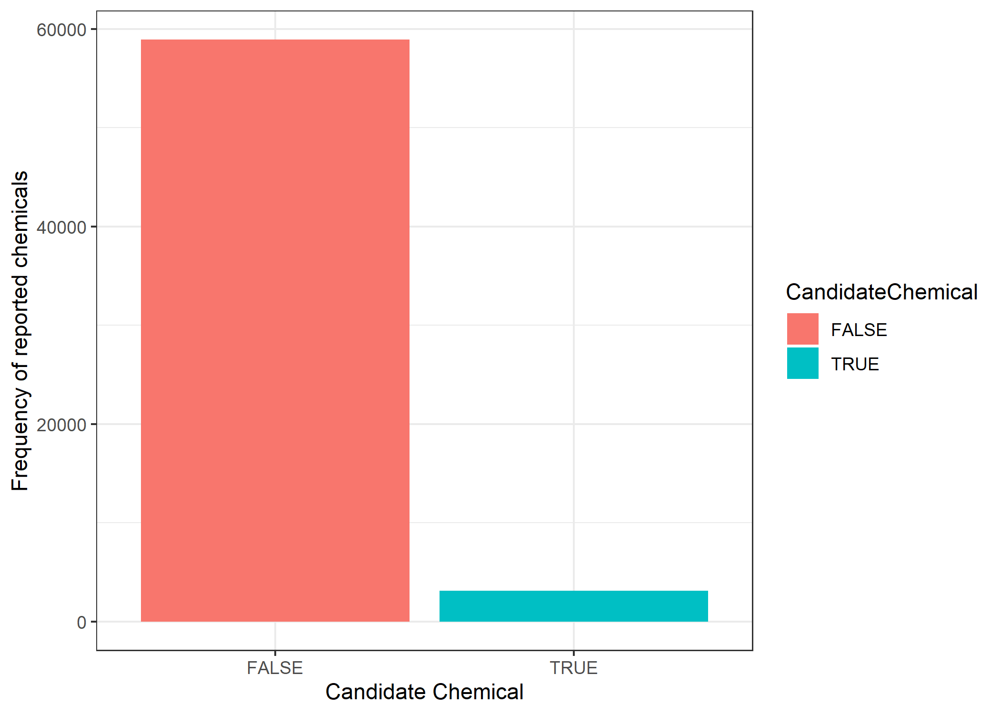
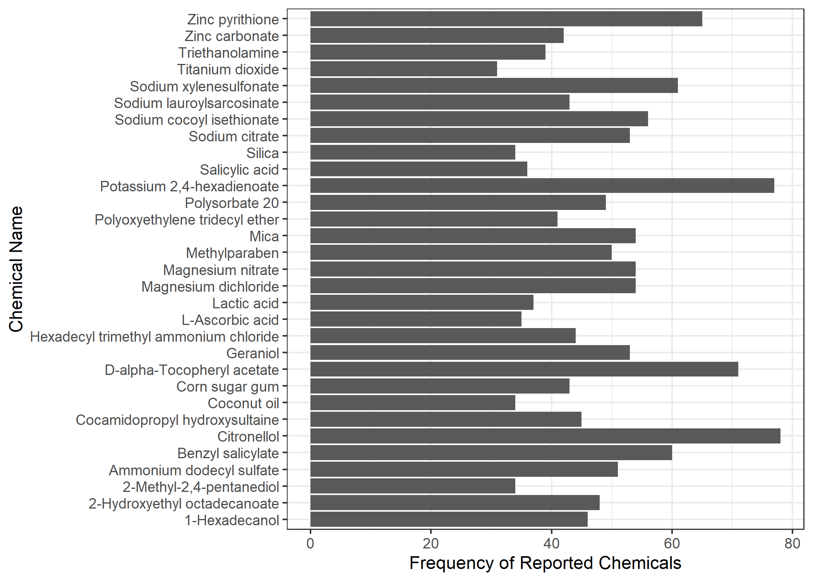

```{r setup, include=FALSE}
knitr::opts_chunk$set(echo = TRUE)
```

```{r message = FALSE, warning = FALSE ,echo = FALSE}
# Loading libraries which may be required
if(!require(tidyverse)) install.packages("tidyverse", repos = "http://cran.us.r-project.org")
if(!require(caret)) install.packages("caret", repos = "http://cran.us.r-project.org")
if(!require(knitr)) install.packages("knitr",repos = "http://cran.us.r-project.org")
if(!require(kableExtra)) install.packages("kableExtra", repos = "http://cran.us.r-project.org")

library(tidyverse)
library(caret)
library(knitr)
library(kableExtra)
```

# Executive Summary

# 1. Introduction

In 2008, California passed the Green Chemistry law which authorized the Department of Toxic Substances Control (DTSC) to develop and implement regulations creating the Safer Consumer Products Program (SCP) (see [Safer Consumer Products Program Overview](https://dtsc.ca.gov/scp/)). These [regulations](https://govt.westlaw.com/calregs/Browse/Home/California/CaliforniaCodeofRegulations?guid=IAD4F8D705B6111EC9451000D3A7C4BC3&originationContext=documenttoc&transitionType=Default&contextData=(sc.Default)) are found in Title 22 Chapter 55 of the California Code of Regulations.

The SCP regulations define a science based approach to evaluating and identifying consumer products which contain hazardous chemicals used as ingredients that may cause adverse impacts to public health or the environment, in addition to evaluating potentially safer alternatives which may have the same functional use[^1] as the hazardous ingredients used in products. The process which SCP uses to evaluate consumer products is depicted in Figure 1 below and is composed of four steps. The first step of the process is the Candidate Chemicals (CC) List. This list, which contains hazard traits and/or environmental or toxicological endpoints for chemicals, is drawn from lists published by various authoritative bodies such as international organizations and federal or state agencies. The CC list is dynamic and is regularly updated by SCP based on changes made to the authoritative lists (see [SCP's Candidate Chemicals page](https://dtsc.ca.gov/scp/candidate-chemicals-list/) for more information on how the CC list is built). The second step of the process is the Priority Products phase, where consumer products are evaluated for chemicals of concern to determine if they pose adverse impacts to public health or the environment. If SCP finds evidence of adverse impacts, then those consumer products become designated as Priority Products[^2] and regulated via a formal rulemaking process. The consumer products which are evaluated by SCP are based on selected product categories listed in its three-year Priority Product Workplan.[^3] The third step is the Alternative Analysis phase, where responsible entities (REs)[^4] such as manufacturers perform alternative analyses to determine if they can find safer alternatives than the chemical or concern(s) used in their consumer product identified in the regulation. Based on the alternative analyses submitted to SCP by manufacturers, SCP then issues a regulatory response. As shown in Figure 1, regulatory responses are varied. For example, SCP may decide to require REs to provide more information, or it may decide to require the implementation of safety measures or administrative controls. Preference is given to regulatory responses that give the greatest level of protection to the environment and public health.

[^1]: functional use is defined as the role that a chemical plays in a consumer product. For example toluene, which is a known respiratory and reproductive toxicant, typically functions as a solvent.

[^2]: Priority Products are defined as product-chemical combinations which pose adverse impacts to people or the environment because of the presence of hazardous chemicals

[^3]: Every three years, SCP publishes a Priority Product Workplan detailing its policy priorities and product categories that it will investigate.

[^4]: According to Chapter 55 of the California Code of Regulation, responsible entities are defined as manufacturers, importers, retailers, or retailers

```{r,message = FALSE, warning = FALSE ,echo = FALSE,out.width = "90%",fig.pos = "H",fig.cap = "Overview of the SCP process for regulating Priority Products containing chemicals of concern. SCP's role in the process is depicted in blue and the roles of responsible entities (REs) are shown in orange"}

# The name of this figure is called SCP Process and it is saved under
# Data Visualizations

 

```

When evaluating consumer products, SCP considers many factors such as:

1.  the prevalence and concentration of chemicals of concern (or Candidate Chemicals) in consumer products;
2.  the potential for Candidate Chemicals in consumer products to adversely impact children's and worker's health; and
3.  the potential for Candidate Chemicals in consumer products to adversely impact environmental justice communities[^5]

[^5]: Environmental justice is an important policy priority as environmental justice communities may be more overburdened, compared to the general population, by adverse exposures to hazardous chemicals present in consumer products. An example of an environmental justice community are nail salon technicians. In California, the majority of nail salon technicians are of Vietnamese decent and face language barriers, are women of reproductive age, and in contrast to other professions, they work for longer hours. Therefore, they are at a higher risk for adverse health impacts due to exposure from a multitude of Candidate Chemicals present in nail products.

In the process of evaluating consumer products, SCP studies the whole life cycle of consumer products from the manufacturing stage to a product's end-of-life and disposal stage.[^6] SCP consults various product and market databases to gain an understanding of product types, marketing trends, and determine the prevalence of Candidate Chemicals used in consumer products. However, one issue with product databases is that products may be categorized differently in each database; therefore it is difficult to compare data from different product databases. Currently, when faced with this daunting task, SCP tries to manually harmonize product categories; however, such a task can be cumbersome and may impact a project's timeline and resources beyond those anticipated during project planning. Here we propose to use machine learning as a method for automating the harmonization of product categories from different product databases. The categorization scheme we propose to use is based on how products are classified by the Global Product Classification (GPC) scheme (see [GPC scheme](https://www.gs1.org/standards/gpc)).The GPC scheme is a standard utilized by global trading partners to classify products the same way. In the GCP scheme, products are classified using a product code known as a brick. The brick is constructed according to the following categorization:

[^6]: In some cases, the adverse impact from Candidate Chemicals may occur during product disposal where there may be chemical releases to the environment. One example are microplastics. Although microplastics may be intentionally added to consumer products, the largest source is the result of environmental degradation of plastic products and synthetic textiles. Microplastics have recently been the subject of public attention because of the concern for increasing worlwide plastic pollution. Microplastics are known to bioaccumulate in the environment, are environmentally persistent, and cause adverse health impacts to humans and organisms.

1.  *Segment*: defines the industry sector, for example food and beverages
2.  *Family*: defines a broad division of the segment, for example milk and butter
3.  *Class*: defines a group of categories similar to each other, for example milk and milk substitutes
4.  *Brick*: defines a category of products similar to each other, for example milk (perishable)
5.  *Attribute*: defined as the product detail for a brick. A brick may have more than one attribute, for example milk may have attributes of "level of fat", "source", or "cooking process".
6.  *Values*: defines the breakdown of an attribute. For example "level of fat" may be broken down into "full fat" or "non fat"

# 2. Product Database Selection and Rationale

For this project, we decided to use the Chemical Product Categories database (CPDat) for training algorithms and selecting the best algorithm which may be used to harmonize product categories across different product databases. The CPDat database is publicly available and easy to download. This database is further described below.

The CPDat database is maintained by the United States Environmental Protection Agency (U.S. EPA) and can be accessed live via the U.S. EPA's [Comptox Dashboard](https://comptox.epa.gov/dashboard/)[^7]. The CPDat database can also be downloaded in the form of a zip file containing the dataset in the form of Microsoft excel files and as a MySQL database. For this project, we manually built the CPDat database using the downloaded Microsoft Excel files. These raw data files can be freely accessed on Github using the link provided in the Supplemental Information section of this report. It should be noted that the last update made to the zip file download was in 2015; therefore this data may be outdated. However, because this dataset can be easily downloaded, we chose to use it. The downloaded dataset can be found on Github using the link provided in the Supplementary Information section of this report.

[^7]: The Comptox Dashboard is an online tool which allows users to perform various types of searches such as chemical searches, searches related to product or use categories, or performing toxicological predictions of chemicals. The dashboard is also linked to other databases that can for instance search for high production volume chemicals; such chemicals are those which are imported or manufactured in the United States in amounts which are equal or greater than one million pounds per year

The CPDat database is built using different data sources and contains information on chemicals, product categorization, functional use data on chemicals in consumer products, and additional data such as product composition which is obtained from manufacturer and retail websites [@dionisio2018].

## 2.1. Data Filtering and Rationale

As the CPDat dataset is very large, we filtered it to only include beauty and personal care products. The rationale for applying this filter stems from the significant work SCP is currently doing and has done over the past years evaluating beauty and personal care products. A summary of some of these findings is provided below.

Beauty and personal care products encompass many different products such as cosmetics, personal care products, skin care products, and hair care products. Beauty and personal care products have widespread use among consumers. One study of northern California households found frequent use of beauty and personal care products by all sexes, age groups, and socioeconomic groups [@wu2010].Some of the chemicals used in these products may be Candidate Chemicals and may expose consumers to adverse health effects. Two examples of products within the beauty and personal care product category which SCP has extensively researched are nail products and hair care products, particularly hair straighteners and relaxers.

**Nail Products** \hfill\break

Nail products have widespread use in the United States. Approximately 100 million women use nail products and annual sales of nail products exceeded more than \$1 billion in 2016 [@drugstorenews2016; @statista2020]. There are many different types of nail products such as nail polishes, base coats, acrylic liquid monomers, top coats, and nail hardeners. Nail product users may include women, teenagers, women of reproductive age, and nail technicians. Many users, particularly nail technicians, belong to sensitive subpopulations.

Nail technicians, as was mentioned above in this report, are considered an environmental justice community. According to the United States Census Bureau, in California, 99% of all nail salons are minority-owned and of those 68% are Vietnamese owned [@u.s.censusbureau2012]. Additionally, in California, the majority of nail technicians are of Vietnamese descent, are female, are of low socioeconomic status, and typically work for longer hours (more than 8 hours per week) [@quach2008]. Further, nail salons may be poorly ventilated and nail salon technicians may have inadequate access to personal protective equipment to mitigate exposures to harmful chemicals used in nail products [@goldin2014]. Therefore, in comparison to the general population, nail technician may be at a higher risk to exposures to a multitude of chemicals present in nail products.

SCP recently shared its research findings of 38 different chemicals in nail products with the public. For more information see the recent [Public Workshop on Chemicals in Nail Products](https://dtsc.ca.gov/scp/safer-consumer-products-2022-workshops-events/) which also includes a link to a [background document](https://dtsc.ca.gov/wp-content/uploads/sites/31/2022/07/Nail-Products-Background-Document_Final-accessible.pdf) SCP prepared summarizing its findings and recommendations. Table 1 below provides a summary of Candidate Chemicals SCP is most concerned about. Table 1 also depicts the functional uses and key hazard traits associated with these chemicals.

```{r,message = FALSE, warning = FALSE ,echo = FALSE}

Tab1 <- data.frame("Chemical" = c("Toluene","Formaldehyde","Methyl Methacrylate (MMA)","Triphenyl Phosphate","N,N-Dimethyl-p-Toluidine (DMPT)","N-Methyl Pyrrolidone (NMP)","Acrylic Acid"),"Functional Use" = c("Solvent","Hardener","Monomer in the preparation of artificial nails","Plasticizer","Accelerates polymerization of liquid monomers","Solvent and surfactant","Longer-lasting nail coatings, faster drying times, and easier removal of nail products"),"Hazard Traits" = c("nervous system toxicity, developmental toxicity","carcinogenicity","Dermatotoxicity","Developmental toxicity, liver and thyroid effects","Carcinogenicity and allergic contact dermatitis","reproductive toxicity and developmental toxicity","Respiratory toxicity, dermatotoxicity"))

knitr::kable(Tab1,booktabs = TRUE,caption = "Summary of the Most Concerning Chemicals Used in Nail Products") %>% column_spec(1,border_left = T, border_right = T) %>% kable_styling(latex_options = "scale_down") %>% kableExtra::landscape()
```

**Hair Products** \hfill\break

Hair products, in particular hair straighteners and relaxers, are designed to chemically straighten or relax wavy or curly hair. These products are usually sold as kits and contain many components such as shampoos, activators, and gels. Like nail products, hair straighteners and relaxers are very popular and widely used both in salons and in homes. For example in 2018, hair salons and barbers in California employed approximately 70,000 workers in 2018 with this figure projected to rise to about 6.5 percent in 2028 [@edd2020]. Use of these products is likely to cause adverse heal impacts from exposures to Candidate Chemicals present in them. For example one study which tested three hair relaxers kits identified 35 endocrine-disrupting and asthma causing chemicals [@helm2018]. Additionally, another study found that increased use of hair straightening, increased the risk of breast cancer in women who had sisters with breast cancer [@eberle2020].

Populations vulnerable to Candidate Chemicals present in hair straightening products include children, pregnant women, and hair salon workers. In particular, women of African descent may experience more adverse effects from exposure to hair straightening products due to prolonged use of these products. According to a study, in women of African descent, children as young as four years old may start using hair straightening products [@wright2011]. Continuous use of hair straightening products may lead to scalp disorders and prolonged exposures to toxic chemicals. Further, according to some studies, the presence of endocrine-disrupting chemicals in hair care products has been correlated with adverse health complications such as obesity, diabetes, and an early start to menstruation [@james-todd2011; @mcdonald2018].

In 2021, SCP summarized its findings from its research into 8 different Candidate Chemicals present in hair straightening products. For more information see [SCP's Workshop on Chemicals in Hair Straightening Products](https://dtsc.ca.gov/scp/safer-consumer-products-2021-workshops-events/) and its [background document](https://dtsc.ca.gov/wp-content/uploads/sites/31/2021/05/Chemicals-in-Hair-Straightening-Products-Background-Document.pdf).

**Additional Research of Beauty and Personal Care Products** \hfill\break

In addition to the work on nail products and hair straighteners, SCP is continuing to evaluate beauty and personal care products because of ongoing adverse health concerns.

## 2.2. Exploration of the CPDat Dataset

As was discussed in the previous section, the CPDat dataset was filtered to only include beauty and personal care products. We next explored the CPDat dataset. The results from our data exploration is summarized in this section. The codes used for data cleaning and data exploration can be found on Github using the link provided in the Supplementary Information section of this report.

We note that the data cleaning process involved both the use of R and manual work. Manual data cleaning was required to systematize chemical names in the CPDat dataset. During data cleaning and inspection of the dataset we found that chemical name entries varied. For instance one entry might be "Titanium dioxide" and another one might be "Titanium dioxide (CI 77891)".

To resolve the issue of non-systematic chemical names, we first sought to obtain a complete list of Chemical Abstracts Service Registry Number (CASRN) values for all chemical names in the CPDat dataset as CASRN values represent unique numeric identifiers for chemicals. It is important to note that not all chemicals such as polymers may have an associated CASRN. In those cases, the CASRN entry was set to "NO CASRN". In other cases where the chemical name was not a polymer but no CASRN value was available, we searched the [PubChem database](https://pubchem.ncbi.nlm.nih.gov/) for CASRN values. Then we used the U.S. EPA Comptox Dashboard Batch search feature (Figure 2) to run a batch search of CASRN numbers and obtain a list of chemical names. The results of this batch search are shown in Table S1 and are also saved on Github. We then flagged any cases where a CASRN was being mapped to more than one chemical name and searched each of the identified chemical names in PubChem and compared the resulting CASRN values with the CASRN we used as an input in the batch search. If there was no match between the CASRN found in PubChem with the CASRN used as an input in the batch search, we deleted the chemical name returned by the batch search. If there was a match, then we assumed that the identified chemical names may be synonyms and we removed one of them. In some cases, the decision of which synonym to remove and which one to keep was based on comparing the synonyms with the original chemical names, while in other cases our decision was based on an expert guess. Following the cleaning process, we then copied these chemical names and inserted them as entries in a new column in the CPDat dataset. Finally we manually inspected the new entries and used PubChem to find more common chemical names for any which were named according to the International Union of Pure and Applied Chemistry (IUPAC) conventions. For example toluene, which is a more common name, may be named as 1-Methylbenzene. We also note that in the process of systematizing chemical names in the CPDat dataset, we found several data quality issues such as incomplete or incorrect chemical names. For the purposes of this report, we decided not to resolve these issues and set the corresponding CASRN column entries to "NO CASRN". Therefore our data analysis results for the CPDat dataset may not be representative of all the products in the dataset.

```{r,message = FALSE, warning = FALSE ,echo = FALSE,out.width = "90%",fig.pos = "H",fig.cap = "Overview of the EPA Comptox Dashboard Batch Search Feature. This feature allows users to enter a list of for example CASRN numbers as chemical identifers. Then Comptox searches for all of the chemicals with the entered CASRN numbers. Users can decide to either view these chemicals live or download the results by clicking on the Choose Export Options. From the Export Options users can also select additional chemical identifiers for Comptox to add to the export file."}

# Load Figure which shows the overview of the batch search feature.This is saved
# under the Data Visualizations folder on Github.

 

```

The CPDat dataset is composed of the following columns:

1.  *Product category*: organizational scheme for categorizing products. For example hair dyes and hair straighteners may be categorized as "hair products". Additionally products in CPDat are further classified using additional categorization. These additional categorizations, which we term as product categorization levels in this report, are based on the intended use of a product. For example,a hair conditioner categorized as leave-in is intended to give long-lasting hair health.

2.  *Product Name*: The name of the product.

3.  *Chemical* name: The names of chemicals used in products.

4.  *A preferred chemical name*: The systematic naming convention for chemicals we obtained using the U.S. EPA Comptox Dashboard's Batch Search feature and the PubChem database. For data analysis purposes we used the preferred chemical name.

5.  *CASRN*: The Chemical Abstracts Registry Number for ingredients. In this report, we assume that CASRN is a unique identifier for each ingredient.

6.  *Product Use Category Description*: a short description of a product such as whether it is leave-on or rinse-out. This description is based on how a product is categorized.

Figure 3 provides a comparison of the number of product categories in CPDat. According to this data, shampoos, hand/body lotions, hair styling products, hair conditioners, and face cream/moisturizers were the most frequently found product types in CPDat with frequencies above 10%. Examples of less frequent product types include deodorants, face wash products, fragrances, and hair conditioning treatments (Figure 3).

```{r,message = FALSE, warning = FALSE ,echo = FALSE,out.width = "90%",fig.pos = "H",fig.cap = "Overview of the frequency distribution of product categories in CPDat"}
# Figure 3 is found under Data Visualizations on Github.


```

Using the most frequently found product types in CPDat, we next looked at the distribution of chemicals or ingredients found in these products. The results of this analysis are shown in Tables S2. Because of the extensive list of chemicals found in products in CPDat (Table S2), we applied the following criteria: *i)* number of chemicals greater 1000; *ii)* number of chemicals between 100 and 1000; *iii)* number of chemicals between 30 and 100; *iv)* number of chemicals less than 30. The results of this analysis are shown in Figures A1-A10 in Appendix A and Table S3. Some examples of the most commonly reported chemicals are glycerol, sodium laureth sulfate, sodium hydroxide, titanium dioxide, methylparaben, and propylparaben. According to the [European Commission's Cosmetic Ingredient (CosIng) Database](https://single-market-economy.ec.europa.eu/sectors/cosmetics/cosmetic-ingredient-database_en), which contains data on cosmetic ingredients along with those which are currently restricted or banned in the European Union, these chemicals have multiple functional uses such acting as skin conditioners, surfactants, colorants, and preservatives. This is not surprising given that the most commonly found product types in CPDat are products applied to the skin or hair.

Finally we sought to determine which chemicals in the CPDat dataset among the most prevalent product types are chemicals of concern, i.e. whether they pose adverse health effects. To do that, we used SCP's Candidate Chemicals List. As was discussed above, SCP's Candidate Chemicals List is a database of chemicals containing specific hazard traits which are obtained from publicly available lists published by different authoritative bodies such as federal or state agencies. Figure 4 below compare the number of chemicals in CPDat which are Candidate Chemicals, and the number of chemicals which are not Candidate Chemicals. According to Figure 4, there are more non-Candidate Chemicals than Candidate Chemicals in the CPDat dataset.

```{r,message = FALSE, warning = FALSE ,echo = FALSE,out.width = "90%",fig.pos = "H",fig.cap = "Overview of the frequencies of Candidate and non-Candidate Chemicals in face cream/moisturizers, hair conditioners, hair styling products, hand/body lotions, and shampoos in CPDat"}

# Here we load Figure 4 which is a bar chart depicted the number of chemicals which
# are Candidate Chemicals and the number of chemicals which are not Candidate
# Chemicals in CPDat. It is found under Data Visualizations in Github.


```

Next we looked at the distribution of Candidate Chemicals among the most prevalent products in the CPDat dataset. Again, as the CPDat dataset is extensive, we applied the same filters as described above. The results of this analysis are depicted in Table 2 along with Tables S4 and S5. Tables S4 and S5 show the number of reported of Candidate Chemicals by product type between 10 and 100, and less than 10, respectively in the CPDat dataset. According to this data, Candidate Chemicals reported at high frequencies include chemicals such as methylparaben, sodium hydroxide, propylparaben, octamethylcyclotetrasiloxane, quaternium-18, benzalkonium chloride, and formaldehyde (Table 2 and Table S5). According to SCP's Candidate Chemicals List, some of the associated hazard traits of the chemicals are endocrine toxicity, reproductive toxicity, dermatotoxicity, bioaccumulation, and environmental persistence.

```{r,message = FALSE, warning = FALSE ,echo = FALSE}
# Here we create Table 2 which will depict the number of reported Candidate Chemicals
# greater than 100 by product type in the CPDat dataset.

# Set working directory
setwd("./Data Visualizations")

Tab2 <- readxl::read_excel(path = "CPDatCommonProdCC_100.xlsx")

knitr::kable(Tab2,col.names = gsub("[.]"," ",names(Tab2)),booktabs = TRUE,caption = "Frequency of reported Candidate Chemicals greater than 100 among prevalent product types in CPDat") %>% column_spec(1,border_left = T, border_right = T) %>% kable_styling(latex_options = "hold_position")
```

# 3. Methods

As discussed in the section above, CPDat was used to train algorithms and select the best algorithm which may be used to harmonize product categories. We used the GPC scheme (see section 1) as a strategy for classifying products in CPDat dataset. The GPC scheme is saved on Github using the link provided in the Supplementary Information section of this report.

Before running any machine learning algorithms on the data we first manually inspected the product categorization schemes used in the CPDat dataset to ensure that all of the products in this dataset belong to the beauty, personal care, and hygiene product category used by GPC. This was done by using the GPC search feature (<https://gpc-browser.gs1.org/>) to search product categories in the CPDat dataset and verifying that each product category belong to the GPC beauty, personal care and hygience category. Products which did not fall in the GPC category were removed from CPDat. For example, products designed for acne treatments are categorized within the Healthcare GPC category, therefore these products were removed. In some cases searches of product categories in GPC did not yield any results which occurred frequently with the CPDat dataset. In these instances we looked at the Product category description column to see if definitions were provided for the product categories. If this was not available, then we performed manual searches of a handful product names belonging to a product category to determine if those products were intended for beauty and personal care. Next, as the CPDat dataset is extensive and could cause issues due to limitations on computer memory usage, we decided to randomly select a smaller subset of the CPDat dataset. Finally, using the GPC product categorization scheme we created a new column to the CPDat dataset and added GPC brick codes based on the product categories in CPDat.

## 3.1. Data Preprocessing

Since machine learning algorithms use numerical data, we first performed data preprocessing to convert the textual input in the form of product categories into numerical data. Before the conversion to numerical data we also performed the following steps:

1.  Converted all instances of uppercase characters to lowercase characters;

2.  Removed all leading and trailing spaces, including any spaces between words; and

3.  Removed punctuation marks such as colons, semicolons, and commas.

Conversion of textual to numeric data involves the construction of a vector where each word has certain properties. For example, one of these properties, which is the most important, is finding similar embedding for words similar to each other. There are currently several word embedding techniques available. For this report we chose the **term frequency-inverse document frequency (TD-IDF)** method as this embedding technique was applied in two studies using machine learning algorithms on textual data, and in of one of these the TD-IDF method was found to increase accuracy [@oancea2023; @vandenbulk2022].

The TD-IF method uses count factorization to give more importance to certain words. More frequently used words are considered to be less important as these tend to stop words, while less commonly used words are more important as these tend to contain more useful information. The score given to a word is defined by equation 1 below.

```{=tex}
\begin{equation}
w_{i,j} = tf_{i,j}\times idf_i
\end{equation}
```
In this equation, $w_{i,j}$ represents the score of word *i* in document *j*, $tf_{i,j}$ denotes the frequency of word *i* in document *j*, and $idf_i$ is defined as follows.

```{=tex}
\begin{equation}
idf_i = \log(\frac{n}{df_i}) + 1
\end{equation}
```
In equation 2, *n* represents the total number of document while $df_i$ defines the number of documents which contain word *i*. The embedding for word *i* is then given by $(w_{i,1},w_{i,2},...,w_{i,N})$ where N is equivalent to the number of dimensions.

To apply the TD-IF method, we used the [superml](https://cran.r-project.org/web/packages/superml/index.html) R package. With the TD-IF method, we applied the same parameters used by @oancea2023. These were limiting the dimension of the resulting numerical vector dimension to 3,000 elements and applying bi-grams, tri-grams, and single words. In textual or sentiment analysis, bi-grams refers to a collection of two consecutive words in a sentence, while tri-grams refers to a collection of three consecutive words in a sentence. Bi- and tri-grams are important for computers to understand that combinations of words in a sentence have a certain meaning. Further, according to @oancea2023, limiting the vector dimension to 3,000 elements is important to prevent issues when training machine learning algorithms for product classification. 

## 3.2. Model Training and Validation

As discussed previously the CPDat dataset was used to train machine learning models and select the best algorithm which could be use as a product classification harmonizer.The CPDat dataset was split into a training and test set where the training set consisted of 80% of the data, and the test set containing the remaining 20%. The training data was used to train four machine learning algorithms, naive Bayes, random forest, logistic regression, kNN, and classification tree. Each of these algorithms is further described below.

### 3.2.1. Naive Bayes

Naive Bayes (NB) is typically used in text classification because it has been been shown to be efficient and fast in addition to being an effective algorithm in classifying text [@vandenbulk2022]. The NB algorithm computes the probability that a certain data point belongs to a class using Bayes' theorem with the assumption that all of the features of the data point are independent of each other. Bayes' theorem is given by

```{=tex}
\begin{equation}
P(y_i \mid x_i) = \frac{P(x_i \mid y_i)\times P(y_i)}{P(x_i)}
\end{equation}
```
In this equation $x_i$ is a data point while $y_i$ is its class.

In some cases $P(x_i)$ may be difficult to compute but may be ommited as $P(x_i)$ is a constant. Thus, with the features of $x_i$ being constants and $P(x_i)$ removed from the equation above, the probability of a certain class can be estimated as follows

```{=tex}
\begin{equation}
P(y_i \mid x_i)\alpha P(y_i) \prod_{j = 1}^{M} P(x_{i,j} \mid y_i)
\end{equation}
```
where $x_{i,j}$ is a feature of $x_i$, $M$ represents the total number of features of $x_i$, while $P(Y)$ and $P(x_{i,j} \mid Y)$ are estimated from the data. A last step in the algorithm involves normalization of the probabilities over the classes so they sum to one with the biggest probability taken as the final prediction.

For this report, we used the multinomial naive bayes as in this case we had more than two possible outcomes.

### 3.2.2. Random Forest

Random Forest (RF) algorithms have also been shown to be effective in text classification [@vandenbulk2022], hence the reason why we decided to apply it. The RF algorithm works by constructive in parallel multiple decision trees which are binary in nature to make a prediction. At each iteration in the process, a new decision tree is built in three steps. In the first step, a random subset of the data is selected with replacement. This is then followed by a random selection of features from the total set of features. In the last step, "the feature and the threshold with the most error reduction is chosen according to the weighted Gini impurity $I_{wg}$, which is a metric to represent that a data point is classified incorrectly if the distribution of the split is followed." The second and third steps are then repeated until a branch will contain data points of only one class. Once all iterations are complete, the final prediction is computed via a majority vote of all of the created decision trees. A given decision tree makes a prediction by taking the path "according to the given data point until it reaches a end node corresponding to a class" [@vandenbulk2022].

The Gini impurity is itself calculated according to the following equation:

```{=tex}
\begin{equation}
I_{WG} = \sum_{i = 1}^{B} \frac{N_i}{N}(1-\sum_{c\epsilon C} P(C = c \mid N_i)^2)
\end{equation}
```
where B denotes the number of branches, N represents the number of data points distributed across the branches, $N_i$ denotes the number of data points in branch *i*, and C represents the possible classes.

### 3.2.3. k-nearest neighbor

The k-nearest neighbor algorithm is composed of a variable parameter known as k which is equivalent to the number of nearest neigbors. The k-nearest neighbor algorithm function by finding the nearest data points in a dataset. These data points are found by determining which of them are closest to what is referred as a query data point. Once the closest data points are located, majority voting rule is applied to find which class appeared more frequently. This is then ruled to be the final classification for the query [@uddin2022].

### 3.2.4. Classification Tree

A classification and regression tree (CART) builds a decision tree. In a decision tree, nodes become split into subnodes based on the threshold value of an attribute. The root node of a decision tree is used as a training set and it is then split into two based on the best chosen attribute and its threshold value. This process continues until a stopping rule is reached or no further splitting is possible. The CART algorithm makes use of the Gini impurity, defined above, when splitting a dataset into a decision tree.

### 3.2.5. Performance measurement

The performance of each of the algorithms were measured using accuracy (acc), precision (pre), recall (re) and the F1 score. These three metrics are defined by equations 6, 7,8, and 9.

```{=tex}
\begin{equation}
acc = \frac{TP + TN}{TP + FP + TN + FN}
\end{equation}
```
```{=tex}
\begin{equation}
pre = \frac{TP}{TP + FP}
\end{equation}
```
```{=tex}
\begin{equation}
re = \frac{TP + TN}{TP + FN}
\end{equation}
```
```{=tex}
\begin{equation}
F1 = \frac{prere}{pre + re}
\end{equation}
```
In these equations, $TP$ are true positives or correctly classified classes, $FP$ are false positives or classes which have been falsely predicted as positive, $TN$ are true negatives which are classes correctly predicted as negative, and $FN$ are false negatives which are classes incorrectly predicted as negative.

# 4. Results

The CPDat dataset was split into training and test sets and three machine learning learning algorithms were trained and overall performance was measured using the test set. The trained algorithms were navie bayes, random forest, k-nearest neighbor, and classification tree. The overall performance for each algorithm was measured by reporting accuracy, precision, recall, and the F1 score. Performance was also assessed by comparing the GPC brick codes predicted by each algorithm to the actual GPC brick codes.

Table 3 below compares performance characteristics of the trained algorithms. The results indicate that out of four trained algorithms, the k-nearest neighbor had the highest accuracy and precision scores. It should be noted that we could not compute recall and F1 scores. One possible reason for this was that for some of the product categories in CPDat we could no find corresponding GPC brick codes. In these cases, a value of 1 was entered in the GPCBrickCode column. It may be likely that in these cases, the trained algorithms were not able to predict any GPC brick codes.

```{r,message = FALSE, warning = FALSE ,echo = FALSE}
# Create table 3. This is found in the Clean Data folder on Github.

setwd("./Clean Data")

Tab3 <- readxl::read_excel(path = "ModelPerformanceStatistics.xlsx")

knitr::kable(Tab3,col.names = gsub("[.]"," ",names(Tab3)),booktabs = TRUE,caption = "Model Performance Comparisons") %>% column_spec(1,border_left = T, border_right = T) %>% kable_styling(latex_options = "hold_position")
```

When comparing predicted and actual GPC brick codes, we see that the random forest, k-nearest neighbor, and the classification tree algorithms performed better than the multinomial naive bayes algorithm as the number of true matches between predicted and actual GPC brick codes was lower for the multinomial naive bayes algorithm (659) compared to the other three algorithms (Table 4).

In conclusion, we see that the multinomial naive bayes model performs poorly based on the low number of true matches between predicted and actual GPC brick codes (Table 4) and the low accuracy and precision scores (Table 3). While random forest, k-nearest neighbor, and the classification tree algorithms performed better based on the high number of matches between predicted and actual GPC brick codes, the accuracy and precision scores for the the k-nearest neighbor algorithm was higher compared to the random forest and classification tree models. Therefore, it can be inferred that for product classifications, the k-nearest neighbor algorithm is a much better model.

```{r,message = FALSE, warning = FALSE ,echo = FALSE}
# Create Table 4 which will compare predicted and actual GPC brick codes. The data
# in this table can be found by running the code titled Product Classification
# Comparisons.

Tab4 <- data.frame("Method" = c("Multinomial Naive Bayes",
                                           "Random Forest",
                                           "Nearest Neigbor Algorithm",
                                           "Classification Tree"),
                               "True Predictions" = 
                                 c(659,731,731,731),
                               "False Predictions" = 
                                 c(72,72,72,72))

knitr::kable(Tab4,col.names = gsub("[.]"," ",names(Tab4)),booktabs = TRUE,caption = "Model Prediction Comparisons") %>% column_spec(1,border_left = T, border_right = T) %>% kable_styling(latex_options = "hold_position")
```

# 5. Conclusion

The goal of this project was to use machine learning approaches as a tool to harmonize product categories as one of the problems in comparing product data among different product databases is that products are categorized differently by product databases. In this project, we sought to use the U.S. EPA's CPDat database to train and test several algorithms, multinomial naive bayes, random forest, k-nearest neighbor, and classification tree. The end goal was to find the best algorithm which may be used as product classification harmonizer. The CPDat database was first filtered to only include personal care products to avoid issues with long execution times. Then the brick codes from the GPC categorization scheme were added to the filtered CPDat database and these were used as the output variable. For training and testing purposes, the CPDat database was split into a training set containing 80% of the data in CPDat and a test set containing the remaining 20% of the data. Based on the training results, we found that out of the four algorithms we trained, the k-nearest neighbor algorithm performed better based on the much higher accuracy and precision scores (Table 3), indicating that the k-nearest neighbor algorithm is better for product classification purposes and could be used as a product classification harmomizer.

One of the many limitations of this project is that the CPDat database was filtered to prevent long execution times. To better assess the performance of the four algorithms we trained, the full CPDat database should be used. Secondly, we used the CPDat product categories as the predictors. A more thorough assessment should also include product names. Another limitation of this project was that in some cases we were not able to find GPC brick codes for all of the products in the CPDat database. This may indicate that a different product categorization scheme should be used for harmonization purposes. For example [@oancea2023] used the Classification of Individual Consumption According to Purpose to Purpose (COICOP) database to classify products, and according to their results, the authors were able to classify products without encountering any issues. Further, we manually added GPC brick codes to the products in the CPDat database which was a time consuming process. A much better approach would be to try and semi-automate this process. Finally, we only used the CPDat database for training and testing purposes. To determine whether the k-nearest algorithm can be used as tool for harmonizing product categories across different product databases, a second database should be used for validation purposes. However, this was beyond the scope for this project.

# References

::: {#refs}
:::

# Supplementary Information

All codes, datasets, and data visualizations can be found by referring to the following Github repository link, https://github.com/moradkhantig/Harmonization-of-Product-Categories.

Supplementary data is also included as part of this report:

Table S1: CPDat Comptox Batch Search Results

Table S2: Distribution of chemicals in the most prevalent products in CPDat

Table S3: Products in CPDat with chemical counts less than 30

Table S4: Products in CPDat with Candidate Chemicals counts between 10 and 100

Table S5: Products in CPDat with Candidate Chemicals counts less than 10.

\newpage

# Appendix {.unnumbered}


\beginappendix

```{r,message = FALSE, warning = FALSE ,echo = FALSE,out.width = "90%",fig.pos = "H",fig.cap = "Number of chemicals in face cream/moisturizers in CPDat with frequencies between 100 and 1000"}
# Here we read in Figure A1.


```

```{r,message = FALSE, warning = FALSE ,echo = FALSE,out.width = "90%",fig.pos = "H",fig.cap = "Number of chemicals in hair conditioners in CPDat with frequencies between 100 and 1000"}
# Hear we read in Figure A2.


```

```{r,message = FALSE, warning = FALSE ,echo = FALSE,out.width = "90%",fig.pos = "H",fig.cap = "Number of chemicals in hair styling products in CPDat with frequencies between 100 and 1000"}
# Hear we read in Figure A3.


```

```{r,message = FALSE, warning = FALSE ,echo = FALSE,out.width = "90%",fig.pos = "H",fig.cap = "Number of chemicals in hand/body lotions in CPDat with frequencies between 100 and 1000"}
# Hear we read in Figure A4.


```

```{r,message = FALSE, warning = FALSE ,echo = FALSE,out.width = "90%",fig.pos = "H",fig.cap = "Number of chemicals in shampoos in CPDat with frequencies between 100 and 1000"}
# Hear we read in Figure A5.


```

```{r,message = FALSE, warning = FALSE ,echo = FALSE,out.width = "90%",fig.pos = "H",fig.cap = "Number of chemicals in face creams/moisturizers in CPDat with frequencies between 30 and 100"}
# Hear we read in Figure A7.


```

```{r,message = FALSE, warning = FALSE ,echo = FALSE,out.width = "90%",fig.pos = "H",fig.cap = "Number of chemicals in hair conditioners in CPDat with frequencies between 30 and 100"}
# Hear we read in Figure A8.

knitr::include_graphics('./Data Visualizations/CPDat_HairCond10030.png')
```

```{r,message = FALSE, warning = FALSE ,echo = FALSE,out.width = "90%",fig.pos = "H",fig.cap = "Number of chemicals in hair styling products in CPDat with frequencies between 30 and 100"}
# Hear we read in Figure A9.


```

```{r,message = FALSE, warning = FALSE ,echo = FALSE,out.width = "90%",fig.pos = "H",fig.cap = "Number of chemicals in hand body/lotions in CPDat with frequencies between 30 and 100"}
# Hear we read in Figure A9.


```

```{r,message = FALSE, warning = FALSE ,echo = FALSE,out.width = "90%",fig.pos = "H",fig.cap = "Number of chemicals in shampoos in CPDat with frequencies between 30 and 100"}
# Hear we read in Figure A10.


```
